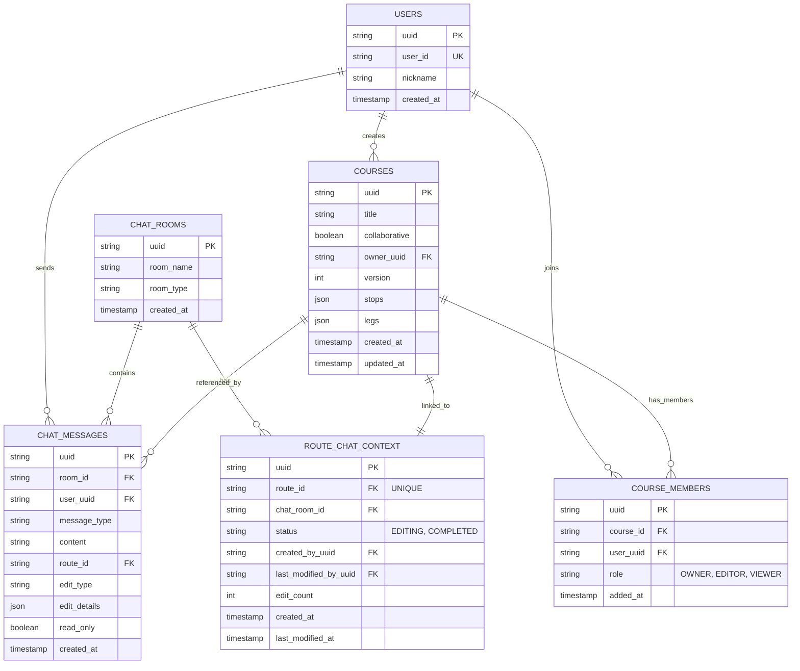
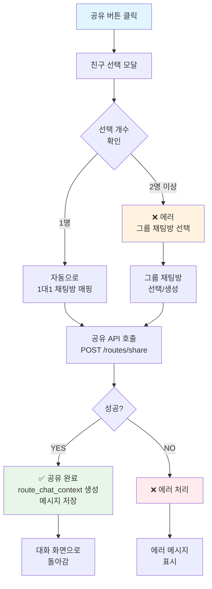
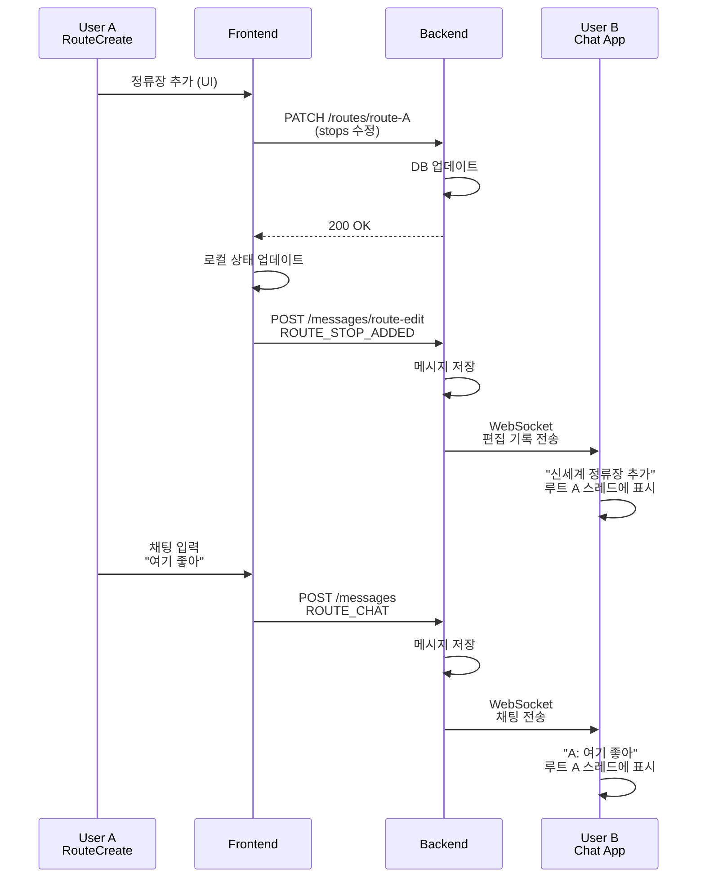
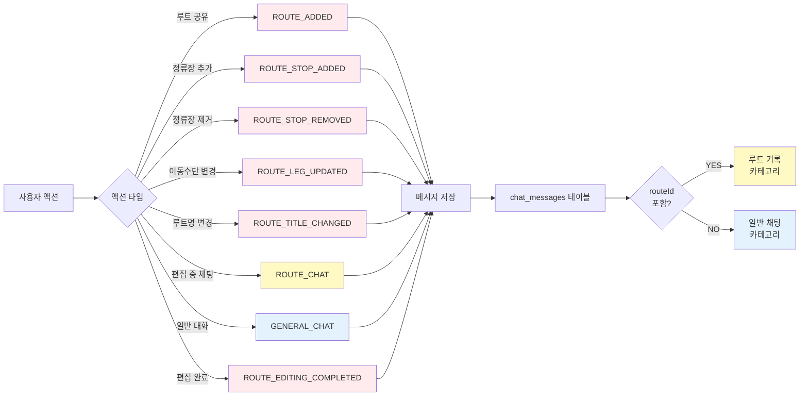

# 공동 루트 채팅 구조 개선 요구사항 (V2 - 단순화 버전)

## 📋 목차

1. [핵심 원칙](#핵심-원칙)
2. [현재 문제](#현재-문제)
3. [해결책](#해결책-1-루트--1-채팅방)
4. [사용자 시나리오](#사용자-시나리오)
5. [데이터베이스 스키마](#데이터베이스-스키마)
6. [API 엔드포인트](#api-엔드포인트)
7. [프론트엔드 플로우](#프론트엔드-플로우)
8. [구현 체크리스트](#구현-체크리스트)

---

## 핵심 원칙

### **1 루트 = 1 채팅방**

```
루트 A
  └─ Primary Chat Room (1개만!)
       ├─ 편집 기록 (모두 여기에)
       ├─ 편집 중 채팅
       └─ 모든 협업 히스토리
```

**이점:**

- ✅ 편집 기록이 한곳에 모임
- ✅ 동기화 필요 없음
- ✅ 버전 충돌 없음
- ✅ 구현이 간단함
- ✅ UX가 명확함

---

## 현재 문제

### 문제 1: 여러 채팅방에 공유 시 기록이 분산됨

```
루트 A를 다음에 공유:
├─ A ↔ B 1대1 채팅방
├─ A ↔ C 1대1 채팅방
└─ A ↔ D 1대1 채팅방

그리고 B, C, D가 함께 편집하면:
- 편집 기록이 어디에?
- 어느 채팅방에서 봐야 함?
- 기록이 중복 저장됨?
```

---

### 문제 2: 새로운 채팅방이 자꾸 생성됨

```
친구 공유 모달에서
"새로운 채팅방을 만드시겠습니까?"
  ↓
YES → 또 다른 채팅방 생성
      → 같은 루트가 2개 이상의 채팅방과 연결
      → 혼란 발생
```

---

## 해결책: 1 루트 = 1 채팅방

### 핵심 규칙

```
친구 1명 선택
  └─ 1대1 채팅방 (자동 생성/재사용)
     └─ 이 채팅방이 Primary

친구 2명 이상 선택
  └─ ❌ 에러 팝업
     "2명 이상은 그룹 채팅방을 선택하세요"
     └─ 그룹 채팅방으로 공유 (자동 생성/재사용)
```

**따라서:**

- 1 루트는 항상 1개의 채팅방과만 연결
- 편집 기록은 그 채팅방에만 저장
- 명확하고 간단함

---

## 사용자 시나리오

### 시나리오 1: 1대1 채팅에서 공유 & 편집

```
1️⃣ A가 "창원 루트" 생성

2️⃣ 공유 버튼 클릭
   → 친구 선택 모달 열림

3️⃣ B 선택 (1명만)
   → 자동으로 "A ↔ B" 1대1 채팅방 선택

4️⃣ 공유 완료
   ├─ route_chat_context 생성
   │  ├─ route_id: route-A
   │  ├─ chat_room_id: chat-AB
   │  └─ status: EDITING
   │
   ├─ 채팅방에 메시지 저장
   │  ├─ ROUTE_ADDED: "A가 창원 루트 공유했습니다"
   │  └─ messageType: GENERAL_CHAT
   │
   └─ B의 앱에서 초대 받음

5️⃣ B가 수락
   ├─ course_members에 B 추가
   └─ role: EDITOR

6️⃣ A가 정류장 추가
   ├─ PATCH /api/courses/route-A
   ├─ 메시지 저장
   │  └─ messageType: ROUTE_STOP_ADDED
   │     routeId: route-A
   │     roomId: chat-AB
   │
   └─ B의 채팅앱에 실시간 업데이트

7️⃣ A: "여기 좋아" (편집 중 채팅)
   ├─ 메시지 저장
   │  └─ messageType: ROUTE_CHAT
   │     routeId: route-A
   │     roomId: chat-AB
   │
   └─ B가 실시간 수신

8️⃣ A가 "편집 완료" 클릭
   ├─ status: EDITING → COMPLETED
   └─ 메시지 저장
      └─ ROUTE_EDITING_COMPLETED

9️⃣ A가 친구 C와의 1대1에도 공유하고 싶음
   ├─ 친구 C 선택
   ├─ 1대1 채팅방 (A ↔ C) 로드
   ├─ 새로운 route_chat_context는 생성 안함
   │  (route-A는 이미 chat-AB와 연결됨)
   │
   └─ 메시지만 저장
      └─ messageType: ROUTE_SHARED
         content: "루트 공유됨 (읽기 전용)"
         readOnly: true

🔟 C가 채팅앱에서 루트 보기
   ├─ ✅ 루트 조회 가능
   ├─ ❌ 편집 불가 (readOnly)
   └─ "이 루트는 읽기 전용입니다"
```

---

### 시나리오 2: 그룹 채팅에서 공유 & 편집

```
1️⃣ A가 "부산 루트" 생성

2️⃣ 공유 버튼 → 친구 선택
   ├─ B 체크
   ├─ C 체크
   └─ D 체크

3️⃣ 다음 버튼 클릭
   ├─ 선택 개수 확인: 3명
   │
   └─ ❌ 에러 팝업
      "2명 이상과 편집하려면 그룹 채팅방을 선택하세요"

4️⃣ [그룹 채팅방 선택] 버튼
   ├─ 기존 그룹 채팅방 목록
   └─ 새 그룹 채팅방 생성

5️⃣ 새 그룹 채팅방 생성
   └─ "부산 루트 편집팀" (B, C, D)

6️⃣ 공유 완료
   ├─ route_chat_context 생성
   │  ├─ route_id: route-부산
   │  ├─ chat_room_id: chat-group-BCD
   │  └─ status: EDITING
   │
   └─ B, C, D 모두 편집 가능

7️⃣ B, C, D가 함께 편집
   ├─ B: 정류장 추가
   │  └─ 메시지 저장 (chat-group-BCD)
   │
   ├─ C: 정류장 제거
   │  └─ 메시지 저장 (chat-group-BCD)
   │
   └─ D: 이동수단 변경
      └─ 메시지 저장 (chat-group-BCD)

   모든 기록이 chat-group-BCD에만 저장됨 ✅

8️⃣ 편집 완료
   ├─ status: COMPLETED
   └─ 시스템 메시지
      "편집이 완료되었습니다"

9️⃣ A가 친구 E와의 1대1에도 공유
   ├─ 같은 루트
   ├─ 다른 채팅방 (A ↔ E)
   ├─ readOnly: true (읽기만)
   │
   └─ 편집 기록은 여전히
      chat-group-BCD에만 있음 ✅
```

---

## 데이터베이스 스키마

### ERD (Entity Relationship Diagram)



---

### 1. ROUTES 테이블 (기존)

```sql
CREATE TABLE courses (
    uuid UUID PRIMARY KEY,
    title VARCHAR(255) NOT NULL,
    collaborative BOOLEAN DEFAULT false,
    owner_uuid UUID NOT NULL,
    version INT DEFAULT 0,
    stops JSONB,
    legs JSONB,
    created_at TIMESTAMP DEFAULT NOW(),
    updated_at TIMESTAMP DEFAULT NOW(),
    FOREIGN KEY (owner_uuid) REFERENCES users(uuid)
);
```

---

### 2. ROUTE_CHAT_CONTEXT 테이블 (새로 추가)

```sql
CREATE TABLE route_chat_context (
    uuid UUID PRIMARY KEY,
    route_id UUID NOT NULL UNIQUE,  -- ← UNIQUE! 1개만
    chat_room_id UUID NOT NULL,

    -- 상태: EDITING(편집 중) / COMPLETED(편집 완료)
    status VARCHAR(50) NOT NULL DEFAULT 'EDITING',

    -- 생성 정보
    created_by_uuid UUID NOT NULL,
    created_at TIMESTAMP DEFAULT NOW(),

    -- 수정 정보
    last_modified_by_uuid UUID,
    last_modified_at TIMESTAMP,

    -- 통계
    edit_count INT DEFAULT 0,

    created_at TIMESTAMP DEFAULT NOW(),
    FOREIGN KEY (route_id) REFERENCES courses(uuid) ON DELETE CASCADE,
    FOREIGN KEY (chat_room_id) REFERENCES chat_rooms(uuid),
    FOREIGN KEY (created_by_uuid) REFERENCES users(uuid),
    FOREIGN KEY (last_modified_by_uuid) REFERENCES users(uuid)
);

-- 중요한 인덱스
CREATE UNIQUE INDEX idx_route_chat_context_route_id
    ON route_chat_context(route_id);
CREATE INDEX idx_route_chat_context_chat_room
    ON route_chat_context(chat_room_id);
```

---

### 3. CHAT_MESSAGES 테이블 (수정)

```sql
ALTER TABLE chat_messages ADD COLUMN (
    message_type VARCHAR(50) NOT NULL DEFAULT 'GENERAL_CHAT',
    route_id UUID,
    edit_type VARCHAR(50),
    edit_details JSONB,
    read_only BOOLEAN DEFAULT false
);

-- message_type 값:
-- GENERAL_CHAT          : 일반 채팅
-- ROUTE_ADDED           : 루트 공유됨
-- ROUTE_SHARED          : 루트 공유 (다른 방)
-- ROUTE_STOP_ADDED      : 정류장 추가
-- ROUTE_STOP_REMOVED    : 정류장 제거
-- ROUTE_LEG_UPDATED     : 이동수단 변경
-- ROUTE_TITLE_CHANGED   : 루트명 변경
-- ROUTE_CHAT            : 루트 편집 중 채팅
-- ROUTE_EDITING_COMPLETED : 편집 완료
-- ROUTE_EDITING_RESUMED   : 편집 재개

-- 인덱스
CREATE INDEX idx_chat_messages_route_id
    ON chat_messages(route_id);
CREATE INDEX idx_chat_messages_room_and_type
    ON chat_messages(room_id, message_type);
```

---

## API 엔드포인트

### 1. 루트 공유 API (개선)

**엔드포인트:**

```
POST /api/routes/{routeId}/share
```

**요청:**

```json
{
  "friendUuids": ["friend-uuid-B"], // 1명만!
  "sharedWithOtherRooms": ["chat-C", "chat-D"] // 추가 공유
}
```

**백엔드 검증:**

```typescript
// 1. 친구 개수 확인
if (friendUuids.length > 1) {
  return {
    status: 400,
    error: "MULTIPLE_FRIENDS_NOT_SUPPORTED",
    message: "1명만 선택하세요. 2명 이상은 그룹 채팅방을 선택해주세요.",
  };
}

// 2. 이미 다른 채팅방과 연결되었는지 확인
const existing = await getRouteChatContext(routeId);
if (existing && existing.status === "EDITING") {
  return {
    status: 409,
    error: "ROUTE_ALREADY_SHARED",
    message: `이미 ${existing.chatRoomId}에서 편집 중입니다`,
    editingChatRoomId: existing.chatRoomId,
  };
}

// 3. 1대1 채팅방 확보
const chatRoomId = await getOrCreateDirectChat(
  currentUser.uuid,
  friendUuids[0],
);

// 4. route_chat_context 생성
await createRouteChatContext({
  routeId,
  chatRoomId,
  status: "EDITING",
  createdBy: currentUser.uuid,
});

// 5. 메시지 저장
await saveMessage({
  roomId: chatRoomId,
  messageType: "ROUTE_ADDED",
  routeId,
  userId: currentUser.uuid,
});

// 6. 추가 공유 (읽기만)
for (const shareRoomId of sharedWithOtherRooms) {
  await saveMessage({
    roomId: shareRoomId,
    messageType: "ROUTE_SHARED",
    routeId,
    readOnly: true,
    content: `${routeTitle} 루트가 공유되었습니다 (읽기 전용)`,
  });
}
```

**응답 (성공):**

```json
{
  "status": 201,
  "data": {
    "routeId": "route-A",
    "chatRoomId": "chat-AB",
    "status": "EDITING",
    "sharedAt": "2026-06-22T11:00:00Z"
  }
}
```

**응답 (실패):**

```json
{
  "status": 400,
  "error": "MULTIPLE_FRIENDS_NOT_SUPPORTED",
  "message": "1명만 선택하세요. 2명 이상은 그룹 채팅방을 선택해주세요."
}
```

---

### 2. 편집 기록 저장

**엔드포인트:**

```
POST /api/chats/{chatRoomId}/messages/route-edit
```

**요청:**

```json
{
  "routeId": "route-A",
  "editType": "STOP_ADDED",
  "editDetails": {
    "stopName": "신세계백화점",
    "lat": 35.2271,
    "lng": 128.5831
  }
}
```

**응답:**

```json
{
  "id": "msg-004",
  "roomId": "chat-AB",
  "routeId": "route-A",
  "messageType": "ROUTE_STOP_ADDED",
  "editDetails": {...},
  "userId": "A",
  "createdAt": "2026-06-22T11:05:00Z"
}
```

---

### 3. 루트별 기록 조회

**엔드포인트:**

```
GET /api/routes/{routeId}/collaborative-context
```

**응답:**

```json
{
  "route": {
    "id": "route-A",
    "title": "창원 루트",
    "version": 5,
    "collaborative": true
  },

  "status": "EDITING",

  "messages": [
    {
      "id": "msg-001",
      "messageType": "ROUTE_ADDED",
      "userId": "A",
      "timestamp": "2026-06-22T11:04:00Z"
    },
    {
      "id": "msg-002",
      "messageType": "ROUTE_STOP_ADDED",
      "userId": "A",
      "editDetails": { "stopName": "신세계" },
      "timestamp": "2026-06-22T11:05:00Z"
    },
    {
      "id": "msg-003",
      "messageType": "ROUTE_CHAT",
      "userId": "A",
      "content": "여기 좋아",
      "timestamp": "2026-06-22T11:06:00Z"
    }
  ],

  "metadata": {
    "createdBy": "A",
    "lastModifiedBy": "A",
    "lastModifiedAt": "2026-06-22T11:25:00Z",
    "editCount": 3,
    "participants": ["A", "B"],
    "chatRoomId": "chat-AB"
  }
}
```

---

### 4. 편집 완료

**엔드포인트:**

```
POST /api/routes/{routeId}/complete-editing
```

**요청:**

```json
{
  "notes": "완성! 내일 사용하자"
}
```

**백엔드:**

```typescript
const context = await getRouteChatContext(routeId);

// 상태 업데이트
await updateRouteChatContext(routeId, {
  status: "COMPLETED",
  lastModifiedAt: new Date(),
  lastModifiedBy: currentUser.uuid,
});

// 메시지 저장
await saveMessage({
  roomId: context.chatRoomId,
  messageType: "ROUTE_EDITING_COMPLETED",
  routeId,
  content: notes,
  userId: currentUser.uuid,
});
```

---

## 프론트엔드 플로우

### 공유 버튼 클릭 플로우



---

### 편집 중 채팅 플로우



---

## 메시지 타입 분류



---

## 상태 관리

```
EDITING 상태
├─ 루트 편집 중
├─ 이 채팅방에서만 편집 가능
├─ 다른 채팅방에 공유 불가
├─ 실시간 동기화 활성화
└─ 멤버들이 모두 편집 권한 있음

        ↓ [편집 완료]

COMPLETED 상태
├─ 편집 종료
├─ 다른 1대1 채팅방에 공유 가능
│  (하지만 readOnly: true)
├─ 실시간 동기화 비활성화
└─ 새로운 멤버는 읽기만

        ↓ [다시 편집]

EDITING 상태 (복귀)
└─ 상태 복귀
```

---

## 구현 체크리스트

### 백엔드

- [ ] **데이터베이스**
  - [ ] `route_chat_context` 테이블 생성
  - [ ] `chat_messages` 테이블에 필드 추가
    - [ ] `message_type` (VARCHAR)
    - [ ] `route_id` (UUID FK)
    - [ ] `edit_type` (VARCHAR)
    - [ ] `edit_details` (JSONB)
    - [ ] `read_only` (BOOLEAN)
  - [ ] 인덱스 생성

- [ ] **API 엔드포인트**
  - [ ] POST `/routes/{routeId}/share` (친구 1명만 검증)
  - [ ] POST `/chats/{roomId}/messages/route-edit` (편집 기록)
  - [ ] POST `/routes/{routeId}/complete-editing` (상태 변경)
  - [ ] GET `/routes/{routeId}/collaborative-context` (기록 조회)

- [ ] **비즈니스 로직**
  - [ ] 1개의 route_id당 1개의 chat_room_id만 허용
  - [ ] 친구 1명 선택만 허용 (2명+ 시 에러)
  - [ ] EDITING 상태에서 다른 방에 공유 불가
  - [ ] COMPLETED 상태에서 readOnly 공유만 가능

- [ ] **실시간 동기화**
  - [ ] WebSocket에서 routeId 기반 필터링
  - [ ] 편집 기록 broadcast (같은 채팅방 멤버만)

### 프론트엔드

- [ ] **친구 선택 모달**
  - [ ] 1명만 선택 가능하도록 UI 제약
  - [ ] 2명 이상 선택 시 에러 메시지

- [ ] **루트 공유**
  - [ ] 공유 API 호출 (1명 검증)
  - [ ] 추가 공유 옵션 (readOnly)

- [ ] **편집 화면 (RouteCreateScreen)**
  - [ ] 편집 기록 자동 저장
  - [ ] 편집 중 채팅 입력 (routeId 함께 전송)
  - [ ] "편집 완료" 버튼

- [ ] **루트 상세 화면**
  - [ ] "편집 기록" 탭 추가
  - [ ] 타임라인으로 표시
  - [ ] 편집 기록 + 채팅 시간순 표시

- [ ] **채팅 앱**
  - [ ] 루트별 스레드 표시
  - [ ] 편집 기록과 채팅 구분
  - [ ] readOnly 루트는 편집 버튼 숨김

### 테스트

- [ ] **단위 테스트**
  - [ ] 친구 1명만 선택 검증
  - [ ] route_chat_context UNIQUE 제약 확인
  - [ ] 메시지 타입별 저장 검증

- [ ] **통합 테스트**
  - [ ] 1대1 채팅 공유 → 편집 → 완료 흐름
  - [ ] 그룹 채팅 공유 → 편집 → 완료 흐름
  - [ ] COMPLETED 상태에서 다른 방 공유
  - [ ] 실시간 동기화

- [ ] **E2E 테스트**
  - [ ] A가 루트 공유, B와 편집, 완료
  - [ ] A가 같은 루트를 C와의 1대1에도 공유
  - [ ] C는 읽기만 가능 확인

---

## 기대 효과

### 단순화

✅ 1 루트 : 1 채팅방 원칙으로 명확함  
✅ 구현이 간단해짐  
✅ 버그 가능성 감소

### 사용성

✅ 편집 기록이 한곳에 모임  
✅ 누가 언제 뭘 했는지 명확함  
✅ 협업 이력 추적 쉬움

### 성능

✅ 동기화 필요 없음  
✅ 효율적인 쿼리  
✅ 버전 충돌 없음

---

**작성일:** 2026-06-22 (V2 - 단순화 버전)  
**핵심 원칙:** 1 루트 = 1 채팅방  
**친구 선택:** 1명만 (또는 그룹 채팅방)  
**우선순위:** 높음
